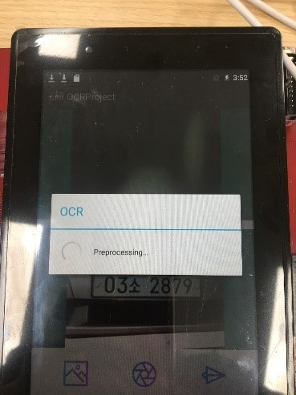
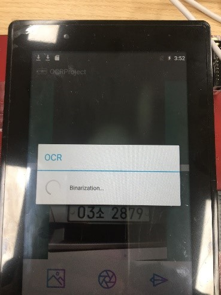

# ocr_project
vehicle license plate recognition

수행 원리 및 동작

문자 이미지 인식은 크게 세 단계이다.

1.  번호판, 문자 영역 추출

2.  추출한 각 문자 영역에서 이미지 문자 데이터 생성

3.  생성한 문자 데이터와 기준 문자 데이터를 비교연산하여 유사도가 높은
    결과 저장

  어플 시작 화면                                                        
  --------------------------------------------------------------------- ---------------------------------------------------------------------------------------
  
  위쪽 화면은 카메라 화면이고, 아래쪽 화면은 처리하기 위한 이미지를 올려놓는 화면이다. 

  문자인식 구동 준비 화면                                                 
  ----------------------------------------------------------------------- ---------------------------------------------------------------------------------------------------
  
  촬영한 사진이 아래쪽 화면에 나타나고 오른쪽 아래 종이비행기 버튼을 터치하면 이미지 처리가 실행됨.

  문자 인식 과정 로딩                                                                                                                                                                                                                  
  ------------------------------------------------------------------------------------ ----------------------------------------------------------------------- ----------------------------------------------------------------------- -----------------------------------------------------------------------
  이미지 처리과정 시작                                                                 가우시안 블러                                                           이진화                                                                  이미지 처리 후 저장
               

| 문자 인식 결과                   |                                  |
|--------------------------------------------------------------------|
|                                  | OCR 처리 결과 창이다. 분석결과와 |
|                                  | 총 처리 시간이 나타나고          |
|                                  | 상세보기를 누를 경우 처리 과정과 |
|                                  | 그 시간을 확인할 수 있다.        |
|                                  |                                  |
|                                  | 총 처리 시간은 이미지를          |
|                                  | 내부저장소에 저장하는 것까지     |
|                                  | 포함한 시간이기에 2초정도로      |
|                                  | 걸린다. 하지만 OCR 을 수행하는   |
|                                  | 시간은 110ms 정도 소요되는 것이  |
|                                  | 확인 가능하며 대부분의           |
|                                  | 처리시간은 파일을 저장하는데     |
|                                  | 소요된다.                        |

[과정 상세 설명 ]{.smallcaps}

  가우시안 블러 처리 (35ms)                                                           
  ----------------------------------------------------------------------------------- -----------------------------------------------------------------------------------------------------------------------------------------------------------------------------------------------------------------------------------------------------------
     가우시안 블러 처리는 안드로이드 내부 라이브러리인 RenderScript를 사용해서 처리했다. 가우시안 블러는 이미지의 노이즈를 제거해주는 효과적인 필터이다. 표준편차를 크게 할 경우 이미지가 뭉게 지는 현상이 나타나서 적절한 값(2)을 사용해서 노이즈를 제거했다.

+----------------------------------+----------------------------------+
| 그레이 스케일, 이진화 처리       |                                  |
| (26ms)                           |                                  |
+==================================+==================================+
| {width="2.675in" | 형태로 JNI로 보내고 grayscale 과 |
| height="3.575in"}                | binarize를 했다.                 |
|                                  |                                  |
|                                  |                                  |
+----------------------------------+----------------------------------+

+----------------------------------+----------------------------------+
| 문자 인식 처리 (49ms)            |                                  |
+==================================+==================================+
| {width="2.8333333333333335in" | 영역 검출, 개별 문자 영역 검출,  |
| height="3.783333333333333in"}    | 각 문자 템플릿 매칭을 통해       |
|                                  | 이미지의 문자를 인식한다.        |
+----------------------------------+----------------------------------+
| 번호판 문자 영역 추출은 3단계를  |                                  |
| 걸쳐서 진행된다                  |                                  |
|                                  |                                  |
| 1.  번호판 영역, 문자 데이터     |                                  |
|     높이 추출                    |                                  |
|                                  |                                  |
| 2.  번호판 왼쪽 경계부터 x축을   |                                  |
|     따라 이동하면서 개별 문자    |                                  |
|     영역 탐색                    |                                  |
|                                  |                                  |
| 3.  개별 문자 영역을 y축을 따라  |                                  |
|     이동하면서 개별 문자의       |                                  |
|     정확한 영역 탐색             |                                  |
|                                  |                                  |
| {width="6.268055555555556in" |                                  |
| height="1.8319444444444444in"}   |                                  |
+----------------------------------+----------------------------------+
